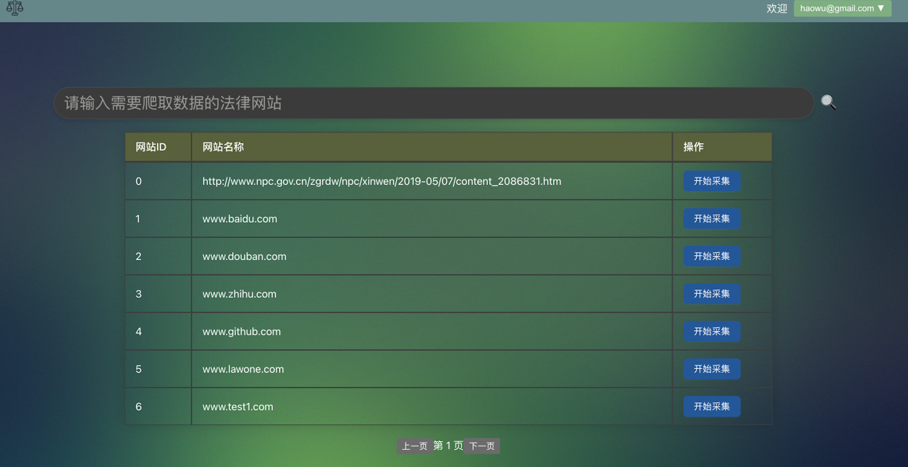

# LAW-TOOLS-ONE 法查查 

* 技术栈: fastapi + react + antd + webpack + sqlite3/mysql

## 项目架构

*  backend 后端系统

    * 爬虫系统

*  fontend 前端系统 - [管理员: 后台管理系统 普通用户: 首页前台]

    * 登录注册
    * 权限管理
    * 路由懒加载

* TODO
    * 会员系统
    * 安全优化 
    * 界面优化
    * 性能优化
    * 多端部署

## 项目运行

* 后端 - backend
    * cd backend/
    * uvicorn main:app --reload
* 前端 - frontend
    * cd frontend/
    * npm install --legacy-peer-deps
    * npm start

## 项目截图

* 登录/注册

* 用户首页

* 后台首页

* 采集截图

